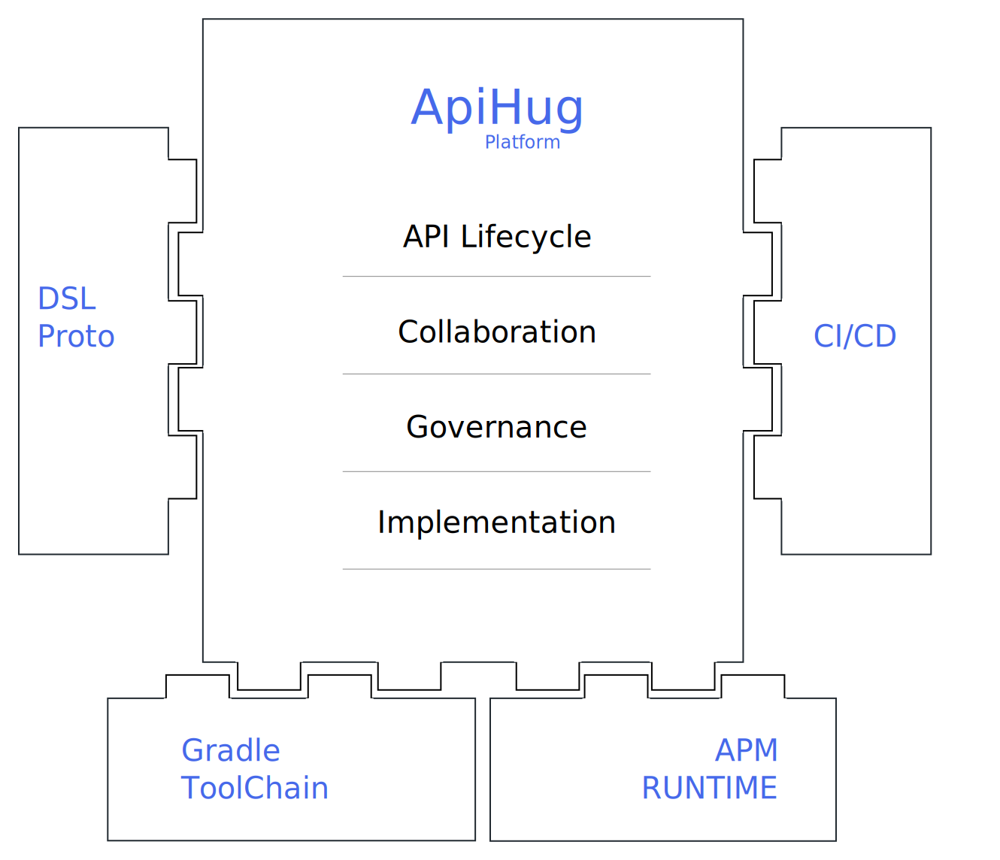

<h1 align="center">
    
</h1>

  <a href="https://github.com/apihug/apihug.com/blob/master/docs/handbook/README.md"><b>🔥 Handbook</b></a>  •
  <a href="https://github.com/apihug/apihug.com/blob/master/docs/design/README.md"><b>⚙️ Design</b></a> •
  <a href="https://github.com/apihug/apihug.com/blob/master/docs/usecase/README.md"><b>📚  Use Case</b></a> •
  <a href="https://github.com/apihug/apihug.com/blob/master/docs/us/README.md"><b>🙋‍♀️ Contact</b></a>

<h1 align="center"> 🤗 ApiHug × {Postman|Swagger|Api...}  = 快↑ 准√ 省↓</h1>

当前版本： **0.3.9-RELEASE**  `@2023-12-07`

💝 [最新版本查询](https://central.sonatype.com/search?q=com.apihug)， 注意， apihug 采用整包发行， plugin + 基础包公用一个版本。

# 🖖 Intro

1. [ApiHug 简介](./docs/introduction/what-is-apihug.md)

# 🔥 Handbook

1. [Start ApiHug in 5 Mins](./docs/handbook/001_very_begin.md)

# 📚 Tutorials

1. [Hope Guide Git](https://github.com/apihug/hope-guides)

# 💎 Design Principles

1. [极具同理心](./docs/principles/why-empathy-is-important.md)
2. [单一信任源](./docs/principles/why-single-source-of-truth-is-important.md)
3. [融合和共生](./docs/principles/why-leverage-exist-resource.md)
4. [开放和协同](./docs/principles/why-open-is-important.md)

# 🙋‍♀️ Contact Us

---

