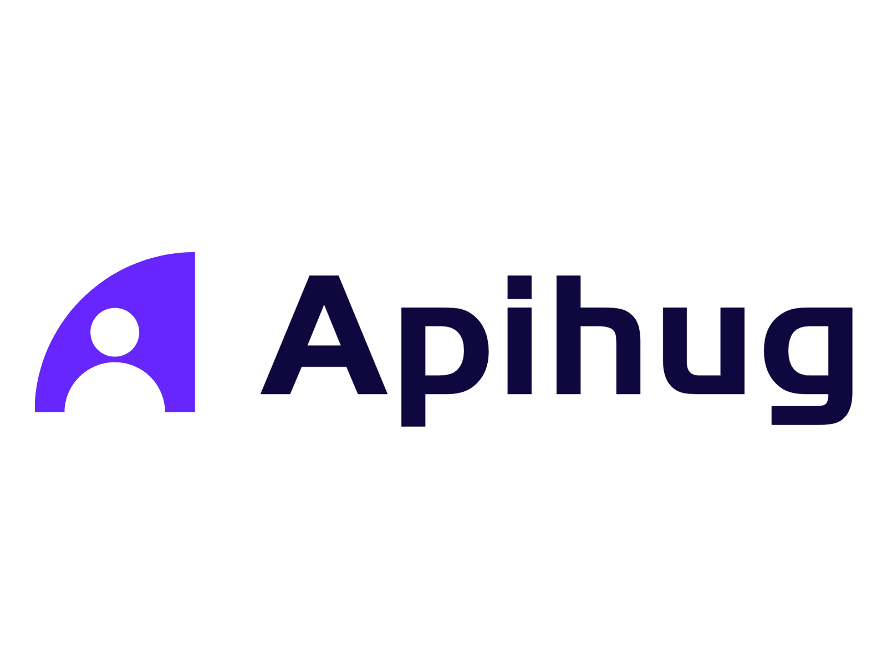

# 

  <a href="https://github.com/apihug/apihug.com/blob/master/docs/handbook/README.md"><b>🔥 Handbook</b></a>  •
  <a href="https://github.com/apihug/apihug.com/blob/master/docs/design/README.md"><b>⚙️ Design</b></a> •
  <a href="https://github.com/apihug/apihug.com/blob/master/docs/usecase/README.md"><b>📚  Use Case</b></a> •
  <a href="https://github.com/apihug/apihug.com/blob/master/docs/us/README.md"><b>🙋‍♀️ Contact</b></a>

<h1 align="center"> 🤗 ApiHug × {Postman|Swagger|Api...}  = 快↑ 准√ 省↓</h1>

当前版本： 

| ApiHug          | ApiHug-IDE         | 说明        | 时间        |
|-------------|------------|-----------|-----------|
| 0.6.0-RELEASE+     | 0.2.0+       | IDE & SDK 不再往后兼容 [里程碑一](./docs/versions/001-milestone.md)|**2024-02-22**|
| 0.5.*-RELEASE-     | 0.1.0*       | 兼容 |**2023-12-28**|

⚠️ 在正式 **1.0+** 版本前， 可能存在比较多bug, 不能保证小版本的兼容， 敬请保持随时同步和更新！(加好友入群，防止惊喜变成惊讶)

💝 [最新版本查询](https://central.sonatype.com/search?q=com.apihug)， 注意， Apihug 采用整包发行， plugin + 基础包公用一个版本。

💠欢è¿ä½¿ç”¨ï¼š [ApiHug - API design Copilot](https://plugins.jetbrains.com/plugin/23534-apihug--api-design-copilot)    [Plugin handbook](./docs/IDE/README.md)  IDE Plugin [Plugin FAQ](./docs/IDE/999_FAQ.md)

🏠 [gitee](https://gitee.com/dearxuecom/apihug.com) | [github](https://github.com/apihug/apihug.com/)

🔥 [apihug-proto](https://github.com/apihug/apihug-proto/)  **proto DSL**

## 🖖 Intro

1. [ApiHug 简介](./docs/introduction/what-is-apihug.md)

## 🔥 Handbook

1. [Start ApiHug in 5 Mins](./docs/handbook/001_very_begin.md)

## 📚 Tutorials

1. [Hope Guide Git](https://github.com/apihug/hope-guides)

## 💎 Design Principles

1. [极具同理心](./docs/principles/why-empathy-is-important.md)
2. [单一信任源](./docs/principles/why-single-source-of-truth-is-important.md)
3. [融合和共生](./docs/principles/why-leverage-exist-resource.md)
4. [开放和协同](./docs/principles/why-open-is-important.md)

## 🙋‍♀️ Contact Us

---

