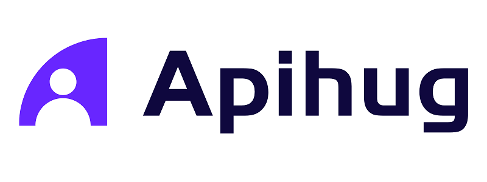

# 

  <a href="https://github.com/apihug/apihug.com/blob/master/docs/handbook/README.md"><b>🔥 Handbook</b></a>  •
  <a href="https://github.com/apihug/apihug.com/blob/master/docs/design/README.md"><b>⚙️ Design</b></a> •
  <a href="https://github.com/apihug/apihug.com/blob/master/docs/usecase/README.md"><b>📚  Use Case</b></a> •
  <a href="https://github.com/apihug/apihug.com/blob/master/docs/us/README.md"><b>🙋‍♀️ Contact</b></a>

<h1 align="center"> 🤗 ApiHug × {Postman|Swagger|Api...}  = 快↑ 准√ 省↓</h1>

| ApiHug          | ApiHug-IDE         | 说明        | 时间        |
|-------------|------------|-----------|-----------|
| 1.0.8-RELEASE+     | 0.5.0+       | 支持 [lint 检查API](https://apihug.com/docs/tool/apihug-lint)|**2024-08-28**|
| 1.0.0-RELEASE+     | 0.5.0+       | [里程碑三](https://apihug.com/docs/kola#upgrade-steps)|**2024-08-06**|
| 0.9.8-RELEASE+     | 0.4.0+       | [里程碑二](./docs/versions/002-milestone.md)|**2024-05-10**|
| 0.8.6-RELEASE+     | -       | [SDK Code Order Enhancement](./docs/framework/versions/0.8.6.md)  |**2024-04-11**|
| 0.7.8-RELEASE+     | -       | [SDK Repository Enhancement](./docs/framework/versions/0.7.8.md)  |**2024-04-10**|
| 0.7.3-RELEASE+     | -       |  服务依赖Feign stub 重构，bug fix|**2024-03-18**|
| 0.6.9-RELEASE+     | 0.2.5+       | 支持脚本测试 [IDEA脚本](./docs/IDE/080_script.md)|**2024-03-15**|
| 0.6.0-RELEASE+     | 0.2.0+       | IDE & SDK 不再往后兼容 [里程碑一](./docs/versions/001-milestone.md)|**2024-02-22**|
| 0.5.*-RELEASE-     | 0.1.0*       | 兼容 |**2023-12-28**|

🤟 **Plugin 0.5.6+** 引入了 [ApiSmart](https://apihug.com/docs/copilot) ;  

💕 ApiSmart make your api design and implement happier; 让你编程不在寂寞 :-)

🦄 **[apihug.com](https://apihug.com/?from=git)** github host apihug homepage. [backup](https://apihug.github.io/?from=git) 🥳

😙 SDK 版本：  &nbsp;Apihug 采用整包发行，Gradle plugin + SDK 统一版本号 &nbsp;[CHANGELOG](./docs/release/changelog/sdk.md)

💠IDEA æ’件： [ApiHug - API design Copilot](https://plugins.jetbrains.com/plugin/23534-apihug--api-design-copilot)  &nbsp;&nbsp; [Handbook](./docs/IDE/README.md)  &nbsp;&nbsp; [FAQ](./docs/IDE/999_FAQ.md)  &nbsp;&nbsp;       &nbsp;[CHANGELOG](./docs/release/changelog/plugin.md)

🏠 [gitee](https://gitee.com/dearxuecom/apihug.com) | [github](https://github.com/apihug/apihug.com/)

😈 **一分钟**开启高质量API开发之旅：🔥 [Bilibili](https://www.bilibili.com/video/BV1KK421k7J8/) &nbsp;|&nbsp; [Youtube](https://www.youtube.com/watch?v=m6N9B6AlSmo&list=PLa8_XrY93pvpAniVC5GQ_Sckw1jvrlvxs) 🔥

😏 **功能一览** [功能列表](https://apihug-com.feishu.cn/sheets/Ai1PsnPKGh0U9xt3KtDc0mj7nSg?from=from_copylink)

## 🖖 Intro

1. [ApiHug 简介](./docs/introduction/what-is-apihug.md)

😆 视频教程：

1. [ApiHug101-Bilibili](https://space.bilibili.com/666522636)
2. [ApiHug101 Youtube](https://youtube.com/@ApiHug?si=C1yw0poHA01zbmyj)

## 🔥 Handbook

⚠️ 在正式 **1.0+** 版本前， 可能存在比较多bug, 不能保证小版本的兼容， 敬请保持随时同步和更新！(加好友入群，防止惊喜变成惊讶)

1. [Start ApiHug in 5 Mins](./docs/handbook/001_very_begin.md)
1. [ApiHug Handbook](./docs/handbook/)

## 📚 Tutorials

1. [Hope Full Example Git](https://github.com/apihug/apihug-full-demo)
2. [apihug-proto](https://github.com/apihug/apihug-proto/)  **proto DSL**

## 💎 Design Principles

1. [极具同理心](./docs/principles/why-empathy-is-important.md)
2. [单一信任源](./docs/principles/why-single-source-of-truth-is-important.md)
3. [融合和共生](./docs/principles/why-leverage-exist-resource.md)
4. [开放和协同](./docs/principles/why-open-is-important.md)

## 🙋‍♀️ Contact Us

---

mail: **apihug@163.com** | **thirdson@163.com**

