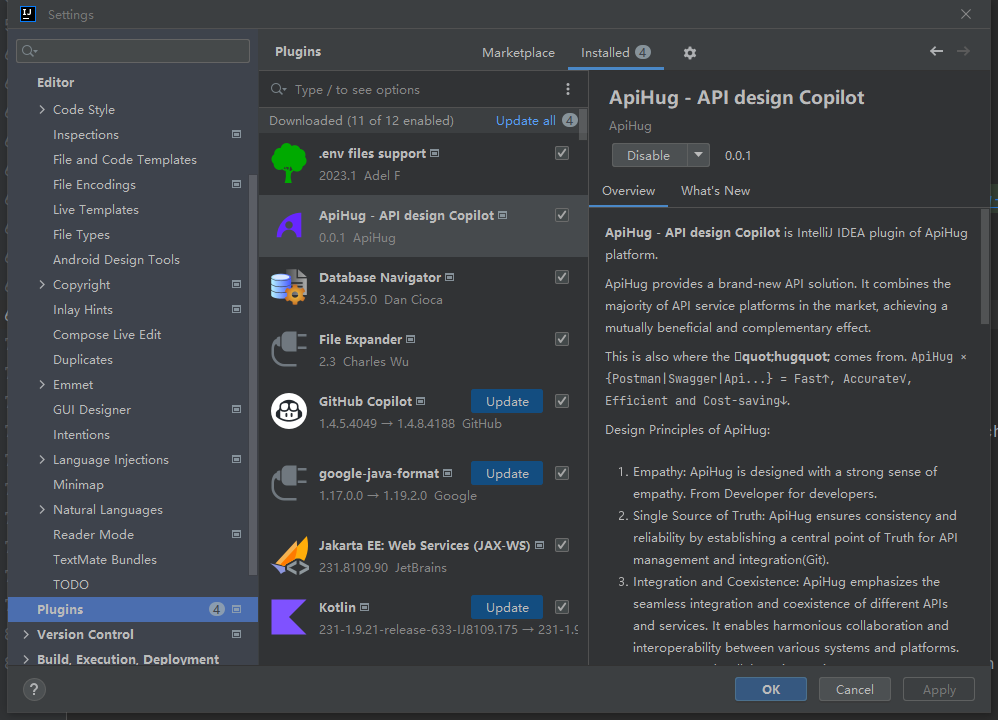
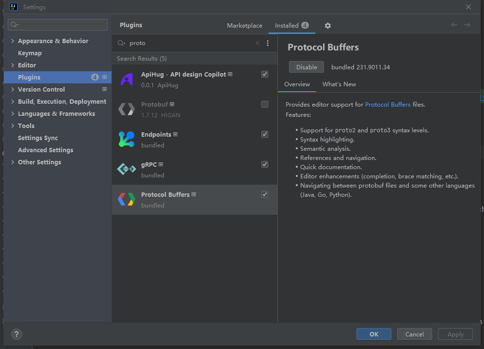

插件版本 **0.2.3**  @ `2024-03-08`

⚠️及时更新升级ApiHug 插件⚠️

💝 IDEA 插件： [ApiHug - API design Copilot](https://plugins.jetbrains.com/plugin/23534-apihug--api-design-copilot)

[Plugin Handbook](./README.md)  &nbsp;&nbsp; [Plugin FAQ](./999_FAQ.md)

## 安装

`IDE>Settings>plugins>Marketplace` 搜索  `ApiHug`:

## 注意 ⚠️

⚠️⚠️⚠️ `ApiHug Plugin` DSL 依赖于 **Protobuf** 插件， 请使用IDE 官方插件， 而非 三方 `HIGAN` 提供插件！否则 ApiHug 插件无法运作。

