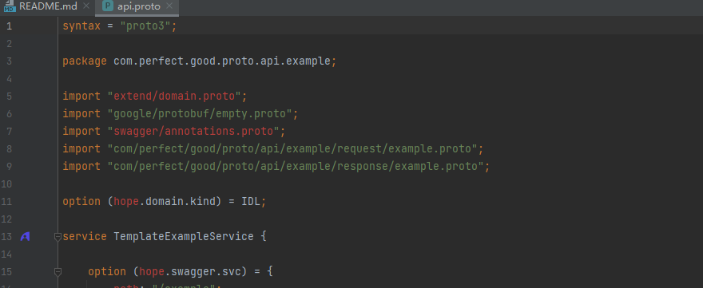

## ProtoBuf

### Proto 文件不能识别, can not recognize proto file

目前IDE 支持的 `Proto buffer` 插件最流行有两个：

1. IDE 自带的， 供应商是 `JetBrains s.r.o.`
2. 三方 `HIGAN`

目前这两个插件是冲突的，只能启动之一， ApiHug Plugin 依赖 IDE 自带的 Proto Editor 插件，进行AST 语法树的解析，所以只能激活  `JetBrains s.r.o.` Proto插件:

### Proto 文件不能import, cannot recognize the proto import

ApiHug SDK proto 导入 `import "swagger/annotations.proto";` 报错：

ApiHug SDK proto import `import "swagger/annotations.proto";` fail：

**01: 编译项目, compile the project** (markdown or gradle task)

**02: 编译完成后， 查看proto 项目的 build缓存**， after compile success, check the project proto build cache. 

`{PROJECT}/{PROTO-MODULE}/build/extracted-include-protos`:

最终所有 `import` 应该都变绿，  eventually all the `import` should turn green!

## Gradle

### 不能识别Gradle, can not recognize as gradle project

IDE 应该弹出 **Load Gradle Project**, 如果通知被被关闭， 打开 **Notification** 手动触发。

IDE should pop up a notification: **Load Gradle Project**， if notification pop up was forbidden, then please open the **Notification** panel to load it manually!

### Gradle 编译报错, gradle compile failure

1. [report issue](https://github.com/apihug/apihug-ide-plugin/issues/new/choose)
2. [Homepage](https://github.com/apihug/apihug.com) find QR code to join out chat group.

## API Design tree not present/refresh

1. refresh the tree
2. rebuild the tree(heavy), recompile and then refresh

if the error still consistent, then  [report issue](https://github.com/apihug/apihug-ide-plugin/issues/new/choose)!
