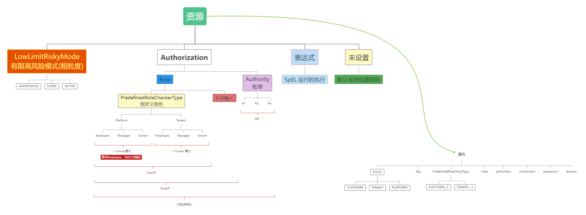

## Authentication

### JWT

## Authorization

How to check the authorities of a login account， you need 3 steps:

1. define a resource(API path)'s authorization properties
2. login account security context customization
3. setup the account and authorities mapping

### Define resource authorization

check [Milestone#code](../versions/001-milestone.md#code) `rbac `part:



#### **1.** setup the authority enum

```protobuf
enum  BookAuthorityEnum {

    option (hope.swagger.enm) = {
        description: "Authority used in book project"
    };

    BOOK_ADD = 0 [(hope.constant.field) = {code: 1,message: "book:add", message2: "Authority to add book"}];
    BOOK_DELETE = 1 [(hope.constant.field) = {code: 2,message: "book:remove", message2: "Authority to delete book"}];
    BOOK_MODIFY = 2 [(hope.constant.field) = {code: 3,message: "book:modify", message2: "Authority to modify book"}];

}
```

#### **2.** update the `hope-wire.json` of the proto module

```json
  "authority" : {
    "enumClass" : "com.novel.book.proto.infra.settings.BookAuthorityEnum",
    "codePrefix" : 10240000
  }
```

#### **3.** protect your resource

```protobuf

  rpc ListCategory (com.novel.book.proto.api.admin.request.CategoryListRequest) returns (com.novel.book.proto.api.admin.response.CategoryVoResponse) {
    option (hope.swagger.operation) = {
      get: "/list-category";
      description: "list all the categories support";
      priority: MIDDLE;
      out_plural: true;
      authorization:{
        rbac:{
          authorities: "BOOK_DELETE";
          combinator: OR;
          predefined_role_checker: PLATFORM_MANAGER
        }
      }
    };
  }
```

#### **4.** runtime configuration

Those configuration will happen on your application module instead of the proto module:

find the auto generated code template at your application project's package : `${PKG}.infra.security` (domain as `Book` example):

```shell
    1. AnonymousBookCustomer.java       
    2. BookCustomer.java                
    3. BookJWTPicker.java               
    4. BookQuickCustomerRoleChecker.java
    5. BookSecurityCustomerContextCustomizer.java
    6. BookSecurityCustomizer.java
```

| Class          | Usage         | Comment        |
|-------------|------------|-----------|
|Anonymous`Book`Customer|Anonymous Customer definition| usually no need to update|
|`Book`Customer|Customer used in the security context| extend for additional fields for dynamically loaded, like authorities, usually `Book`SecurityCustomerContextCustomizer response for init and wrapper it, need extend |
|`Book`JWTPicker|Where to pick the JWT|usually from header, but you can pick from session or cookies|
|`Book`QuickCustomerRoleChecker|Quick Platform\Tenant role checker| usually need to extend |
|`Book`SecurityCustomerContextCustomizer|response for Security context customer initialization| more detail info to/from token, create new Customer like delegate authorities/role fetcher|
|`Book`SecurityCustomizer|Security configuration customize| change global security strategy: like default access check, or specific rule for specific path |

#### **5.** Last piece

This is not what the framework can supply as this depend on your business logic: how to set up your account relationship with the authorities list.

Best practice is to follow the role based access control that is **RBAC**.

SO you may leverage the Authority Enum for example `BookAuthorityEnum`'s message pattern to organize your authorities hierarchy:

Take this book application as example:

```protobuf

BOOK_ADD: book:add
BOOK_DELETE: book:delete
USER_BLOCK: user:block
USER_EDIT: user:edit
ORDER_APPROVE:order:approve
ORDER_DELETE:order:delete
ORDER_MODIFY:order:modify

```

so the hierarchy may looks like:

```shell

+---book
|       add
|       delete
|
+---user
|       block
|       edit
|
+---order
|       approve
|       delete
|       modify

```

㊗️ so enjoy!

## Reference

1. [RBAC-Wiki](https://en.wikipedia.org/wiki/Role-based_access_control)