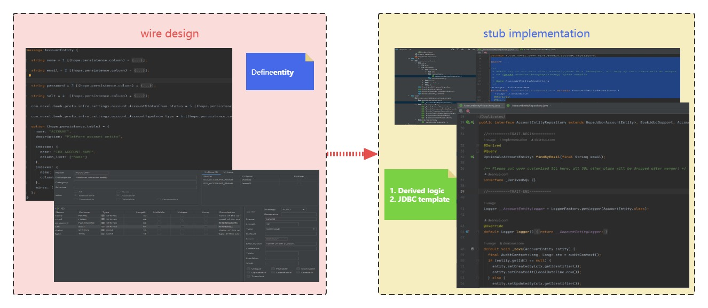

[English](./0.7.8.md) | [简体中文](./0.7.8_cn.md)

💁 If you never touch the `ApiHug` domain entity management, then this migration will never bother you. but better keep rolling release with us! :-)

Latest: <a target="_blank" href="https://search.maven.org/artifact/com.apihug/it-bom"></a>


`0.7.8-RELEASE` Add features:

- Move the `Repository` `@Derived` maintain way to `Trait` separated location, make code clean;
- `lite` as default model for the stub side, make it more swift;



## Repository migration

Target:

1. make generated repository pure and straightforward.
2. make repository derived api easy to maintain

Take an exist `repository`: `com.novel.book.wire.domain.book.repository.BookAuthorRepository` in your module `book-app` as example:

**Exist logic**: in `book-app\src\main\stub\com\novel\book\wire\domain\book\repository\BookAuthorRepository`:

```java
@Repository
@SuppressWarnings("Duplicates")
public interface BookAuthorRepository
    extends HopeJdbc<BookAuthor>,
        BookJdbcSupport,
        BookAuthorDSL,
        ListCrudRepository<BookAuthor, Long> {

  @Derived
  @Query
  Optional<BookAuthor> findByName(final String name);

  //Other method
}
```

⚠️⚠️⚠️ You need to backup your `@Derived` method before run the `stub` command;

As now the `stub` dir code is pure `generated`, that meaning it can be totally removed in next round `stub` command.

### Step1

Run the `stub` command of your module after upgrade the SDK version in the `gradle\libs.versions.toml`:

```toml
[versions]
# libraries
apihug = "0.7.8-RELEASE"
```

Command line, check your project's `README.md`:

```shell
./gradlew.bat book-app:clean stub build -x test -x stubTest
```

After run successfully you will got a new `sourceSet`: `book-app\src\main\trait`;

💁‍♀️ you may need `Reload Gradle Project` from `Gradle` tool window, otherwise the `book-app\src\main\trait` may not be recognized as `sourceSet`

### Step2

1. Manually put the backup `@Derived` to the `_BookAuthorRepository`(trait dir) & `BookAuthorRepository`(stub dir)(only first time migration need this, to keep the old class compilable);
2. Kick off the `stub` command again.

Since now all the `@Derived` Repository methods, will be maintained separated at `book-app\src\main\trait`

1. `stub` job will merger them back to the runtime `BookAuthorRepository` class
2. Avoid any conflict in `BookAuthorRepository` during development(template code vs derived code), keep it pure and straightforward.
3. Much easier way to derived our repository API, the `trait` for SQL logic;

---

### StepX

This way migration need more manually job, but much clearly;

1. create directory `book-app\src\main\trait`
2. create package `t.com.novel.book.wire.domain.book.repository` that is prefix with `t.` of original `com.novel.book.wire.domain.book.repository`
3. add trait `interface` class `_BookAuthorRepository` that is  prefix with  `_` of original  `BookAuthorRepository`
4. make it `extends BookAuthorRepository`
5. copy the `@Derived` method of `BookAuthorRepository` to `_BookAuthorRepository`
6. run `stub` command

This is a easier way for countable `repository` like less than 30 etc;

**Real** Project dir structure:

```shell
+---java
|   \---com
|       \---novel
|           \---book
+---stub
|   \---com
|       \---novel
|           \---book
|               \---wire
|                   \---domain
|                       +---account
|                       |   +---dsl
|                       |   \---repository
|                       +---book
|                       |   +---dsl
|                       |   \---repository
|                       \---job
|                           +---dsl
|                           \---repository
\---trait
    \---t
        \---com
            \---novel
                \---book
                    \---wire
                        \---domain
                            +---account
                            |   \---repository
                            +---book
                            |   \---repository
                            \---job
                                \---repository
```

## PS

since SDK `0.8.3-RELEASE`, introduce more way to handle those easier;

so after define a Entity in your `proto` and run `stub` command you will got a `trait` empty **Repository**:

```java
/**
 * NEVER try to use this class directly, keep it as an interface(default, no public), all body of
 * this interface will be merger to {@link JobEntityRepository} after {@code stub };
 *
 * <p>NEVER try to Overwrite parent {@link JobEntityRepository } or {@link
 * org.springframework.data.repository.ListCrudRepository} 's default method!!
 *
 * @see JobEntityRepository
 * @see com.novel.book.wire.domain.job.JobEntity
 */
interface _JobEntityRepository extends JobEntityRepository {

  /** Please put your customized SQL here, any SQL other place will be dropped after merger! */
  interface _DerivedSQL {}
}
```

Then you can write a customized DAO api:

```java
@Overwrite
default void myDaoApi(){
    
}
```

remember to add `@Overwrite` to this method， then the IDEA will remind you to `Pull method 'myDaoApi' to 'JobEntityRepository'`

Do as the IDEA suggest you, then this method will be pull to parent interface, this will avoid one round of `stub` command;

next time after kick off the `stub` command, you still get the exactly same code/logic.

## Best Tips

You can consider the `_BookAuthorRepository` as Companion class of the `BookAuthorRepository`;

Only the `ApiHug` tool chain handle all those complexities for you!

Image the [Companion objects](https://docs.scala-lang.org/scala3/book/domain-modeling-tools.html#companion-objects) in Scala;

IF YOU meet any problem during upgrade, please contact us:


