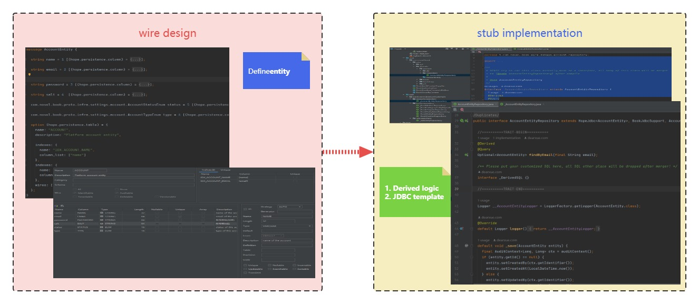

[English](./0.7.8.md) | [简体中文](./0.7.8_cn.md)

💁 如果你尚未使用 `ApiHug` 领域实体对象管理(ORM), 那么这次升级暂不会影响你，但最好和官方保持最新统一版本! :-)

`0.7.8-RELEASE` 添加功能:

- 将 `Repository` 扩展, 迁移到独立的  `trait` 目录管理, 使代码结构更简单清晰;
- `lite` 模式作为 `stub` 默认编译模式，将使他更迅捷;



## Repository 迁移

目的:

1. 使 `repository` 更直接简单.
2. 使 `repository` 扩展更方便维护.

举个在你模块  `book-app` 已存在 的 `repository`为例: `com.novel.book.wire.domain.book.repository.BookAuthorRepository`:

**现有逻辑在**:  `book-app\src\main\stub\com\novel\book\wire\domain\book\repository\BookAuthorRepository`:

```java
@Repository
@SuppressWarnings("Duplicates")
public interface BookAuthorRepository
    extends HopeJdbc<BookAuthor>,
        BookJdbcSupport,
        BookAuthorDSL,
        ListCrudRepository<BookAuthor, Long> {

  @Derived
  @Query
  Optional<BookAuthor> findByName(final String name);

  //Other method
}
```

⚠️⚠️⚠️ 首先保证你的 `@Derived` 已经备份， 在你跑 `stub` 命令前;(如果版本管理，先commit为妙)

因为升级后的 `stub` 只保留纯 `generated`代码, 也就是`stub` 命令后，任何`stub`目录下手动代码都将被清除.

### Step1

跑下本模块的 `stub` 命令， 首先保证你SDK 版本已经被更新到 `0.7.8-RELEASE`+,  `gradle\libs.versions.toml`:

```toml

[versions]
# libraries
apihug = "0.7.8-RELEASE"

```

命令行可以到你项目的 `README.md` 找到:

```shell

./gradlew.bat book-app:clean stub build -x test -x stubTest

```

跑完后你会看到一个新的 `sourceSet`: `book-app\src\main\trait`;

💁‍♀️ 你可能需要到你的 gradle tool window 触发本项目的 `Reload Gradle Project` ，否则可能提醒 `book-app\src\main\trait` 不能被当做 `sourceSet`!

### Step2

1. 手动将 `@Derived` copy 回到 `_BookAuthorRepository`(trait 目录下) & `BookAuthorRepository`(stub 目录)(只有第一次迁移需要，以后只需要在 `_BookAuthorRepository` 编写);
2. 再次启动 `stub` 命令.

从今往后， 所有Repository扩展 `@Derived` 方法, 都在独立 `book-app\src\main\trait` 目录维护：

1. `stub` 命令将你需要融入(trait)的方法（也就是老的`@Derived`方法）合进到运行时的 `BookAuthorRepository` 类
2. 避免 `BookAuthorRepository` 在持续开发中模板和扩展逻辑冲突，保持他的简单和直观.
3. 也很容易维护我们的 repository扩展接口, 这里保持纯的 SQL 逻辑;

### StepX

另外一种迁移方式， 更多手动工作，但是更清晰;

1. 创建目录 `book-app\src\main\trait`
2. 创建 包 package `t.com.novel.book.wire.domain.book.repository`: 原包`com.novel.book.wire.domain.book.repository`加个前缀 `t.`;
3. 添加接口 `interface _BookAuthorRepository` :原接口 `BookAuthorRepository`前缀  `_` (下划线);
4. 添加扩展 `extends BookAuthorRepository` (方便编辑器提示)
5. 将 `BookAuthorRepository` 里所有 `@Derived` 方法拷贝一份到 `_BookAuthorRepository`
6. 执行 `stub` 命令

这个适合有限的 `repository` 类迁移比如少于30个;

---

**真实**项目的目录结构:

```shell
+---java
|   \---com
|       \---novel
|           \---book
+---stub
|   \---com
|       \---novel
|           \---book
|               \---wire
|                   \---domain
|                       +---account
|                       |   +---dsl
|                       |   \---repository
|                       +---book
|                       |   +---dsl
|                       |   \---repository
|                       \---job
|                           +---dsl
|                           \---repository
\---trait
    \---t
        \---com
            \---novel
                \---book
                    \---wire
                        \---domain
                            +---account
                            |   \---repository
                            +---book
                            |   \---repository
                            \---job
                                \---repository
```

## Best Tips

你可以把 `_BookAuthorRepository` 想象成 `BookAuthorRepository`的`伴生类`(虽然有继承关系：方便获得编辑器提示) ;

只是 `ApiHug` 工具链完全帮你处理掉了过程的复杂性!

参考Scala `半生对象` [Companion objects](https://docs.scala-lang.org/scala3/book/domain-modeling-tools.html#companion-objects);

如果你过程中遇到任何问题，请垂询我们:


