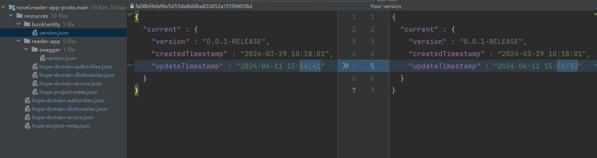

[English](./0.8.6.md) | [简体中文](./0.8.6_cn.md)

## Issue

**ApiHug** spend a lot effort to make automatically generate best-practice template code.

But as the `stub` & `wire` store those AST mapping in the HashMap, some time the auto generated code may very different between versions even a tiny changes happen.

This really make the code merger guy crazy!

so since this version of SDK **0.8.6-RELEASE**, we make you really relief from this boring crazy stuff. include [0.7.8](./0.7.8_cn.md) re-design the repository maintain way;

Latest: 

---

but we still keep track the last compile/build time in the meta file(json).

