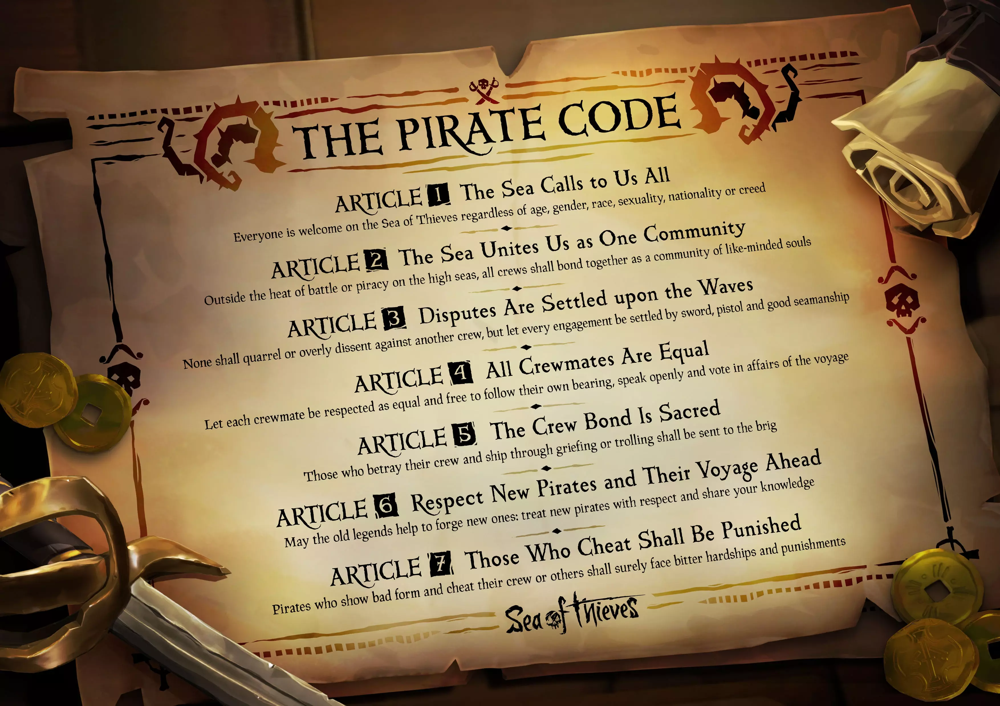
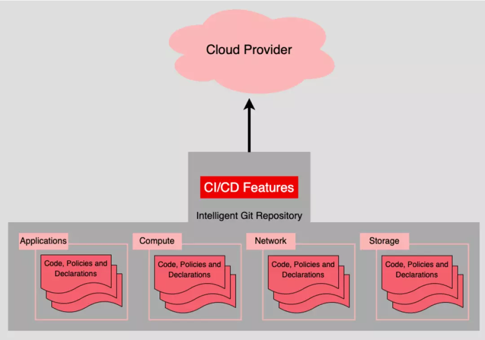
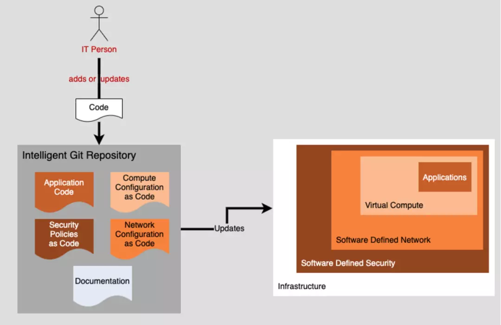
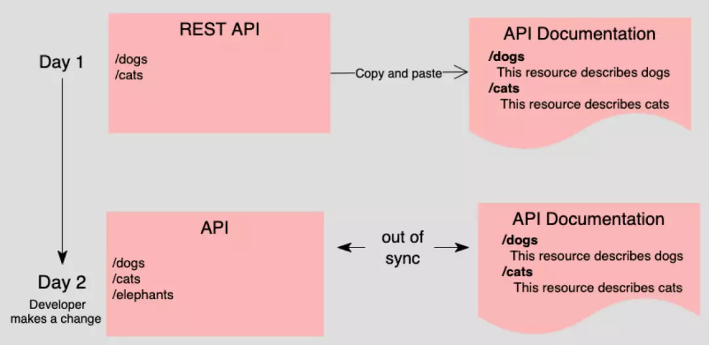
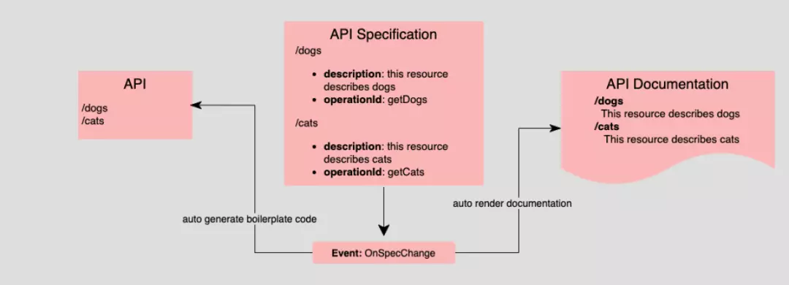
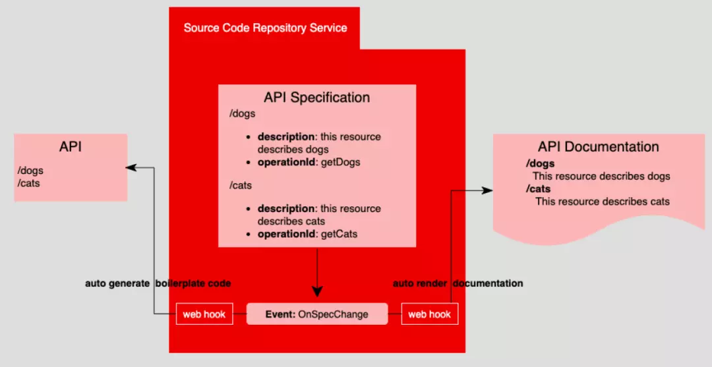

## 概念

`SSOT`： Single Source Of Truth ，单一信任源，字如其意。

曾经计算机的世界被一个叫Mainframe控制，代码和程序都集中在一处；但是现如今随着各种解决方案百花齐放，计算机资源也分布式、去中心化；环境和架构微服务化， 带来了好处也带来了挑战。

管理和协同的碎片化，给不同工作组，同一个工作组不同角色，带来高度自治的自由同时， 也带来难以避免的变化管理的冲突， 这并不是出于恶意，而是因为架构设计缺陷无法适应现代分布式所需的变更管理。 

幸运的有一套方法 single source of truth (SSOT)  + GitOps 原则，可以有效管理你的组织资产变更。

> Single source of truth (SSOT) is a concept used to ensure that everyone in an organization bases business decisions on the same data. 

## 为什么

变更管理，追求**快速、精确**地传递到所有地方，**快速**：所有流程尽量自动化； **精确**：需要排除人为干预，格式化表达：**代码**。

一切都是代码(Code)， 既是程序意义上的人机交互的代码， 也是原则(Law)， Code 和 Law 是两个语义接近概念，比如加勒比海盗里面人人都必须遵循的 海盗法典。

应用(Application), 网络(Networking), 算力资源(Computing resources), 存储(Storage), 所有的一切一切均可以代码化。

统一到代码(Code) 下面就好办了， 相当于将一切 Normalization了，代码时间规则单一化了。

代码有自己检验规则：静态或者动态， 代码有自己的组织、存储、发行方式：Repository & Artificat; Java 世界的 Nexus Repository, Javascript 世界的 npm。

> Git repository is the sole source of truth

基于 Git 构建流程，演变成  GitOps。

现代 Git repository 平台大部分已经将CI/CD交互，融入到自己必备的功能列表中。

当所有的资源都代码化后，GitOps 控制着存储、版本、同步等。

于此原则下， 架构师需要保证所有的成品(artifacts,比如jar包)，有详细关于底层环境架构的描述、展示、控制；部署脚本需要：CI/CD 流程的控制；虚拟环境配置文件；他们应该和数据库的ERD, 架构UML等，同等详细、严谨。

那么这个和整个API生命周期管理有什么关系呢？ 举个栗子：

## 一个例子

API 实现+API 文档如下， 当然这里的API 文档是独立编写的，现在可以直接从代码反向生成文档。但是绝大部分还是断裂的， 如果你是直接使用一些API设计工具，比如ApiFox, Postman，Stoplight 等，两个平行的世界依然存在！

第二天，需求添加了个新的接口 `'/elephants'`， 坏事了， API 文档上面没有同步！
当下有反向生成文档后，反哺到API 共享平台， 无论手动还是半自动化， 但是这个不是个完美方案， 缺陷在， 虽然源码扮演了 SSOT 角色， 但是他没有尽到最大责任；SSOT 角色需要：

1. 供各方访问的方式
2. 真相发生变化时通知到感兴趣各方

显然源码是不具备上面的能力的！那么应该使用什么作为唯一信任源 SSOT?

这个时候需要一个独立的 Specification, 这个 Specification 优先：

> All work emanates from an ever-evolving but controlled specification. This includes coding, documenting, and enhancing software

**规范优先**（Specification First）是一种软件开发方法，其核心理念是所有工作都源自于一个不断演进但受控的规范。这包括编码、文档编写和软件增强等方面。  This is the code, it's the law!

"规范优先" 在API世界里面就有很多：  OpenAPI, gRPC, AsyncAPI, or GraphQL 等；

Specification 作为一个中立的 SSOT, 用以控制，文档和代码的生成，软件开发里不同角色使用 API Specification 作为协同媒介， 如下：

还有一个缺陷：如何阻止 API 开发人员在文档人员不知情的情况下进入源代码并更改 API，从而使内容再次变得不同步？这就是自动化发挥作用的地方。
如下图： 底部显示的 `OnSpecChange` 事件。这表明当 API 规范发生更改时，会以某种方式引发 `OnSpecChange` 事件，感兴趣的各方可以做出相应的反应。

当下的 Git Repository 一般都提供 Web Hook 机制来获取相关的触发，以做下一步动作。

个方案依然有比较大的局限， 触发下一步动作， 自动做代码和文档的更新，特别是代码的更新， 在语言和架构的局限下，依然无法丝滑地做到，风险比较高。

SSOT 易选，同步之道依然漫长， 如何真正根除不同角色、不同环节，对于变动理解的差异， 保持强一致，是个永远值得探索的主题。

## Apihug

[Apihug](https://www.apihug.com)，不仅将 `git` 作为 `API`协议标准单一信息源第一管理工具， 依托各大git服务供应商(Github,GitLab,Gitee 等)，统一管理 `API` 协议，版本迭代； 同时在`API`协议，分发共享上，利用现有分发工具；模块化，复用`API`组件，避免重复工作，显著提升开发效率。

## Refer

- [Implementing single source of truth in an enterprise architecture](https://www.redhat.com/architect/single-source-truth-architecture)
- [Single Source of Truth](https://www.talend.com/resources/single-source-truth/)
- [swaggerhub -The Single Source of Truth for API Development](https://swagger.io/tools/swaggerhub/)
- [Metadata-as-Code SSOT](https://hackolade.com/metadata-as-code.html)
