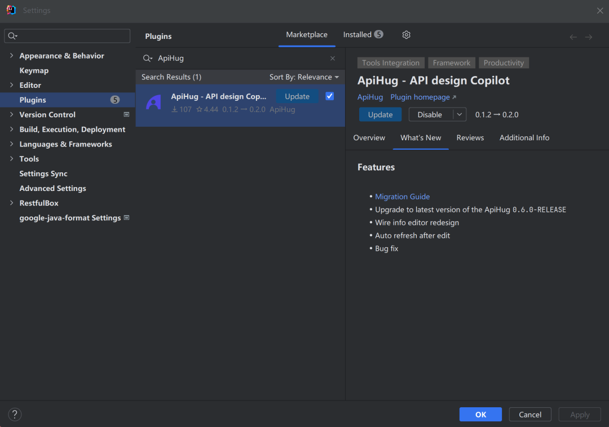

# Milestone(一)

⚠️ 由于修改不再兼容老的风格迁移有风险， 包含基础包,IDE plugin

⚠️ This is an incompatible change, Both the SDK and IDE plugin not compatible with previous version.

⚠️ Upgrade the [Spring boot](#spring-version) to `3.2+` and if any incompatible 3rd party libs(Cloud etc)

😆 Guide：

1. [ApiHug101-Bilibili](https://space.bilibili.com/666522636)
2. [ApiHug101 Youtube](https://youtube.com/@ApiHug?si=C1yw0poHA01zbmyj)

<a target="_blank" href="https://search.maven.org/artifact/com.apihug/it-bom"></a>

[ApiHug - API design Copilot](https://plugins.jetbrains.com/plugin/23534-apihug--api-design-copilot)

## ApiHug [0.6.0-RELEASE] -  2024-02-22

### SDK Features

- `google.protobuf.BoolValue` -> `hope.common.BoolType`, less code, more straightforward. [3 kinds Boolean](../blog/2024Q1/20240222-3-kinds-boolean-issue.md)
- message field deprecated flag picker logic
- `authorization_struct`  --> `rbac` make it more human friendly: `RBAC rbac = 2;`
- support `hope.common.BoolType blank = 49;` for the `String` specific field
   - `empty` vs `blank`,  blank more for the string field, string field may not empty, but may be blank, as it include no qualify character, like space, tab, etc.
- bug fix

## ApiHug-IDE [0.2.0] -  2024-02-22

### IDE Features

1. new wire info panel, link to enum
2. auto refresh after edit
3. upgrade the AST parser
4. authority auto complete
5. bugfix

## Steps

**升级依赖包+IDE版本**：

**Upgrade SDK+IDE Version**：

## Project

1. `{PROJECT}/gradle/libs.versions.toml`
2. `apihug = "OLD_VERSION"` -> `0.6.0-RELEASE`+

## Plugin

1. download: [ApiHug - API design Copilot](https://plugins.jetbrains.com/plugin/23534-apihug--api-design-copilot)  `0.2.0`+
2. upgrade in IDE:



### Code

**1.`google.protobuf.BoolValue` -> `hope.common.BoolType`**

🏁 find all the broken like:

```proto
    empty: {
      value: false
    };
```

**Change TO**:

```proto
    empty: FALSE;
```

**2. `authorization_struct`  --> `rbac`**

🏁 find all the broken like:

```proto
       authorization_struct: {
          authorities: "PLATFORM_MEMBER_OPERATE";
          combinator: OR;
          predefined_role_checker: PLATFORM_MANAGER
        }
      
```

**Change TO**:

```proto
       rbac: {
          authorities: "PLATFORM_MEMBER_OPERATE";
          combinator: OR;
          predefined_role_checker: PLATFORM_MANAGER
        }
```

🥳🥳🥳 all done!

## Spring version

1. check the spring version: `3.2+`
2. other 3rd party lib: **cloud(2023+)**, **mybatis** etc.
3. search google for the key words, or contact me!

**factoryBeanObjectType** issue [Invalid value type for attribute 'factoryBeanObjectType': java.lang.String](https://github.com/spring-projects/spring-framework/issues/31247):

```shell
java.lang.IllegalStateException: Error processing condition on org.springframework.boot.autoconfigure.context.PropertyPlaceholderAutoConfiguration.propertySourcesPlaceholderConfigurer
	at org.springframework.boot.autoconfigure.condition.SpringBootCondition.matches(SpringBootCondition.java:60)
Caused by: java.lang.IllegalArgumentException: Invalid value type for attribute 'factoryBeanObjectType': java.lang.String
	at org.springframework.beans.factory.support.FactoryBeanRegistrySupport.getTypeForFactoryBeanFromAttributes(FactoryBeanRegistrySupport.java:86)
	at org.springframework.beans.factory.support.AbstractAutowireCapableBeanFactory.getTypeForFactoryBean(AbstractAutowireCapableBeanFactory.java:837)
  ...
	... 15 common frames omitted
```

**MappingJdbcConverter** issue;

```shell
	at hope.common.spring.data.persistence.config.HopeAbstractJdbcConfiguration.jdbcConverter(HopeAbstractJdbcConfiguration.java:133)
  ...
Caused by: java.lang.ClassNotFoundException: org.springframework.data.jdbc.core.convert.MappingJdbcConverter
	at java.base/java.lang.ClassLoader.loadClass(ClassLoader.java:520)

	... 66 common frames omitted
```

---

